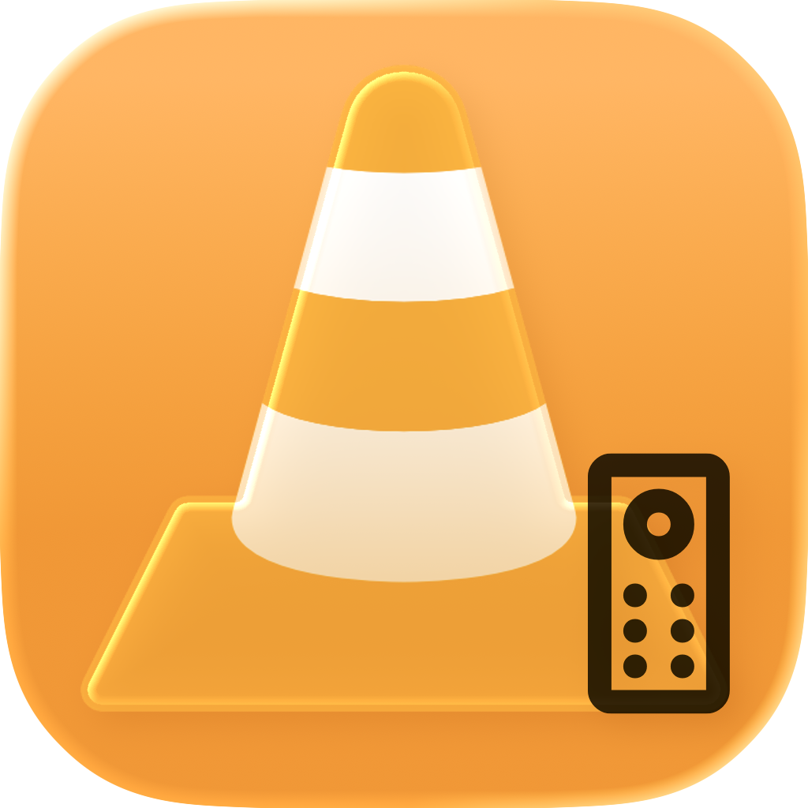

<h1 align="center">


Android TV VLC ADB Remote
</h1>
(catch name i know)

This is a remote app for VLC on Android TV which works via ADB<br>
I needed this for a project so figured I'd open source it, incase anyone wants this. The code is probably a mess but enjoy!<br>
<b>Note:</b> This is macOS only and requires macOS 14.0 Sonoma or above.

<br>You can upload movie files to your Android TV or delete them, play them in VLC, toggle playback, change volume, mute and return to Android TV homescreen

## Prerequisites

1. Install brew
```
/bin/bash -c "$(curl -fsSL https://raw.githubusercontent.com/Homebrew/install/HEAD/install.sh)"
```

2. Install ADB
```
brew install --cask android-platform-tools
```

3. Make sure you have ADB enabled on your Android TV<br>
If you don't know how to do this then follow the documentation [here](https://developer.android.com/tools/adb), I won't provide help for setting up ADB. 

## Other stuff
If you experience issues with the app itself and <b>not</b> an ADB related issue then please create an issue in the issues tab.

Feel free to contribute to the project if you'd like, it'd be super helpful. If the code is a mess sorry, I'm a newbie and its originated as just being a personal tool for myself.
